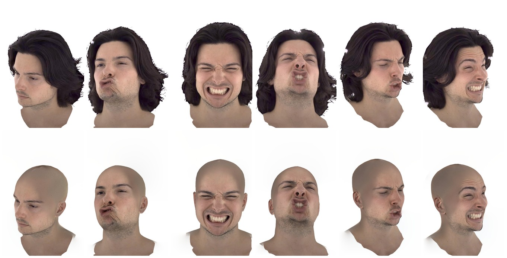
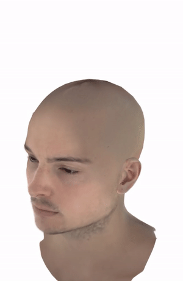
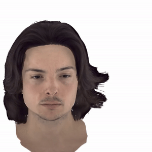
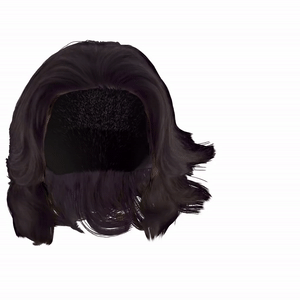

# PhysHead: Simulation-Ready Gaussian Head Avatars
[CVPR 2026] PhysHead: Simulation-Ready Gaussian Head Avatars

## News
[2026-09-20] Released the FLAME tracking code for the Ava-256 dataset and the bald dataset generation code: [VHAP_ava](https://github.com/bernakabadayi/VHAP_ava).  
[2026-09-12] Added a sample dataset. Download from [Keeper](https://keeper.mpdl.mpg.de/f/7150ea288f8847678486/). It includes tracked meshes, a simulation example, and bald images, reconstructed hair.  
[2026-09-12] Released the PhysHead avatar reconstruction code (`physhead-public/`): bald-head training, hair-strand color training, and animated hair rendering. See [`physhead-public/README.md`](physhead-public/README.md).  
[2026-04-21] Added sample hair simulation data. Download from [Google Drive](https://drive.google.com/file/d/1SsM5iodhJeZxGA-gghDr1GwaccQegVmb/view?usp=sharing).  
[2026-04-21] Released the hair simulation pipeline (`hairsim/`). Given a FLAME sequence and a hair mesh, simulate hair in Maya.  

## Dataset

Download data-sample.zip from: https://keeper.mpdl.mpg.de/f/7150ea288f8847678486/ (or [direct download link](https://keeper.mpdl.mpg.de/seafhttp/f/7150ea288f8847678486/?op=view))

## Avatar Reconstruction

Bald-head training, hair-strand color training, and animated hair rendering, built on GaussianAvatars. See [`physhead-public/`](physhead-public/) for the code and setup.

<table>
<tr>
<td></td>
<td></td>
<td></td>
</tr>
</table>

## Hair Simulation

Given a FLAME sequence and a hair mesh, simulate hair in Maya. See [`hairsim/`](hairsim/) for the pipeline and setup.

## Tracking

FLAME tracking for the Ava-256 dataset and generation of the bald training images, built on VHAP. See [VHAP_ava](https://github.com/bernakabadayi/VHAP_ava) for the code and setup.

## Todo

- [x] FLAME tracking code for Ava-256 dataset
- [x] Bald dataset generation code
- [x] PhysHead avatar reconstruction code
- [x] Hair Simulation code
- [ ] Hair preprocessing scripts
